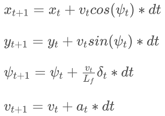
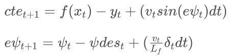

# Udacity Self Driving Car Nanodegree

## Term 2, Project 5 -- MPC Controller

### Name: Ciaran Murphy

### Date: 6-Apr-2018

---

## Introduction

The objective of this project is to implement Model Predictive Control (MPC) to
control a car as it drives around a track in the Udacity simulator.

In this write up, I will cover the points of the project
[rubric](https://review.udacity.com/#!/rubrics/896/view). 


## Compiling

The code can be compiled with no errors or warnings using the provided cmake
file in the project root directory. To compile, move to the root dir of the
project and execute:

```shell
mkdir build && cd build
cmake ..
make

```

This will create a file called `mpc` which is the main executable of the program.


## Description of the Model

MPC uses a Kinematic model of the vehicle to estimate the state at time step
*t+1*, given an estimate of the state at time step *t*. The state of the vehicle is
considered over the following variables in map ("global") coordinates:

| Param | Meaning |
|:------|:--------|
| _x_     | The horizontal position|
| _y_     | The vertical position|
| _psi_   | The angle of orientation|
| _v_     | The velocity|

The kinematic equations for predicting these values at the next time step (t+1)
are given below, taken from the lesson on Vehicle Models called Global Kinematic Model.



In these equations, _dt_ represents the duration of each time step, _delta_
represents the steering angle and _Lf_ is a constant for the vehicle that is
pre-tuned by driving the vehicle at a constant speed in a circle and finding
the optimal value through trial and error.

Two further values are considered that provide a measurement of the correctness
of the vehicle's position relative to a known ideal position:

| Param | Meaning |
|:------|:--------|
| _cte_   | The cross track error, which is the distance from the ideal x,y position|
| _epsi_  | The difference between the actual orientation and the ideal orientation (which is given in this project via waypoints provided by the simulator)|

The equations for calculating _cte_ and _epsi_ are as follows:



In these equations, _f(x)_ is a 3rd order polynomial that best fits the
waypoints and *psi_des* is the arctan of _f(x)_.

So the overall pipeline of the project is summarized as follows:

1. Convert the waypoints (i.e. the guide line) to car coordinates
2. Fit a polynomial to those waypoints
3. Calculate the current _cte_ and _epsi_ given the current position
4. Solve the MPC using the cost function (discussed later)
5. Return new values for steering and throttle that attempt to minimize the
   *cte* and *epsi* errors

There is a further step to compensate for the latency between computation of
desired steering and throttle and the actual actuation of that control data.
More on that later.

### Step 1:

In the pre-processing step, all points are converted to car coordinates, where
the center of the car is considered the origin and the x axis points in the
same direction as the car is facing. Given this coordinate system, the CTE can
be simply set to the y value of the car position. The code for this step is
visible in `main.cpp` and pasted below. For an excellent discussion on how this
works, see [this](https://www.youtube.com/watch?v=h11ljFJeaLo&t=5s) tutorial.

```cpp
// Convert ptsx and ptsy to car coords
for (unsigned int i = 0; i<ptsx.size(); i++)
{
  double dtx = ptsx[i] - px;
  double dty = ptsy[i] - py;

  ptsx[i] = (dtx * cos(0-psi) - dty * sin(0-psi));
  ptsy[i] = (dtx * sin(0-psi) + dty * cos(0-psi));
}

```

### Step 2:

The coefficients of a 3rd order polynomial are found using the method
`polyfit()` in `main.cpp`. This method is the same as was used in the previous
project (PID Control):

```cpp
Eigen::VectorXd polyfit(Eigen::VectorXd xvals, Eigen::VectorXd yvals, int order);

```

New values for *y* can then be computed using the `polyeval()` method also found
in `main.cpp`:

```cpp
double polyeval(Eigen::VectorXd coeffs, double x);

```

### Step 3:

Given that in car coordinates _px_ and _epsi_ are both zero, _cte_ and _epsi_
are computed as follows in `main.cpp`:

```cpp
// Calculate the current cte and epsi

double cte = polyeval(coeffs, 0);
// epsi = psi - atan(cieffs[1] + 2*coeffs[2]*px + 3*coeffs[3]*pow(px, 2)) where psi & px = 0
double epsi = -atan(coeffs[1]);

```

### Step 4:

The state and coefficients of the polynomial are passed to the MPC class as
follows and a vector is returned that contains the new actuation values:

```cpp
auto vars = mpc.Solve(state, coeffs);

```

In `MPC.cpp` the cost function is implemented to take into consideration:

* The square of *cte* weighted by a constant factor
* The square of *epsi* weighted by a constant factor
* The current velocity relative to a target velocity set by `ref_v`
* The square of the steering angle weighted by a constant factor
* The square of acceleration (represented as throttle value) weighted by a constant factor
* The square of the difference in steering angle between steps, weighted by a constant factor
* The square of the difference in acceleration between steps, weighted by a constant factor

The code for this cost calculation is visible in `MPC.cpp` and pasted below:

```cpp
    // The cost is stored is the first element of `fg`.
    // Any additions to the cost should be added to `fg[0]`.
    fg[0] = 0;

    /*
     * Reference State Cost. The constant scalers are used to give certain
     * weights/priorities to each of the cost calculations.
    */

    // Start with the cte, epsi and v
    for (unsigned int i = 0; i < N; i++) 
    {
      fg[0] += 2000*CppAD::pow(vars[cte_start + i] - ref_cte, 2);
      fg[0] += 2000*CppAD::pow(vars[epsi_start + i] - ref_epsi, 2);
      fg[0] += CppAD::pow(vars[v_start + i] - ref_v, 2);
    }

    // Also include steering angle and acceleration (approximated by throttle value)
    for (unsigned int i = 0; i < N-1; i++) 
    {
        fg[0] += 5*CppAD::pow(vars[delta_start + i], 2);
        fg[0] += 5*CppAD::pow(vars[a_start + i], 2);
    }

    // Also include range of change of steering and acceleration
    for (unsigned int i = 0; i < N-2; i++) 
    {
        fg[0] += 200*CppAD::pow(vars[delta_start + i + 1] - vars[delta_start + i], 2);
        fg[0] += 10*CppAD::pow(vars[a_start + i + 1] - vars[a_start + i], 2);
    }

```

The solver computes the optimal new values for acceleration (throttle) and
steering, which are eventually returned back to the simulator.


### Step 5:

Finally, the new actuation values are passed back to the simulator. A detail
here is we must convert the steering angle to unity coordinates before sending
it.

```cpp
msgJson["steering_angle"] = vars[0] / (deg2rad(25) * Lf);
msgJson["throttle"] = vars[1];

```


## Choice of N (timestamp length) and _dt_ (time delta)

The choice of *N* and *dt* essentially boil down to a trade off between
computational efficiency and model accuracy. I found through trial and error
that using a value for *N* below 10 didn't give the model enough data points to
accurately calculate the optimal actuation values and the car struggled to stay
on the track. Values greater than 10 caused the computation to take longer and actually
become a lot less accurate as well. In the end, through trial and error I found the
following values to be a good fit in my case:

```cpp
size_t N = 10;
double dt = 0.1;

```

A further detail that I needed to tweak was the value for `Numeric
max_cpu_time` that is sent to Ipopt as an option. The provided value of 0.5
caused was not sufficient and I found I needed to increase this all the way up
to 50 to achieve any results. With a lower value, the model would return a cost
of 0 which would again cause the car to come to a stop as all actuation would
essentially be turned off. 

One final remark - bizarrely I also found that the model would not work if
I ran it while a YouTube video was playing simultaneously! It took me a while
to realize this.


## Polynomial Fit and MPC Pre-processing

See steps 1 and 2 above.


## Handling Latency

To handle the latency in the actuation, I estimated the state of the car at
100ms in the future using the kinematic equations. This is done before feeding
the data to the MPC for solving, therefore the MPC calculations are actually
happening on an estimated future state of the car rather than the current state
as provided by the simulator. The code is visible in `main.cpp` and pasted
below:

```cpp
// Predict (x = y = psi = 0)
px = v * dt;
py = 0;
psi = - v * delta / Lf * dt;
v = v + acceleration * dt;
cte = cte + v * CppAD::sin(epsi) * dt;
epsi = epsi + psi;

state << px, py, psi, v, cte, epsi;

auto vars = mpc.Solve(state, coeffs);

```

## Vehicle must successfully drive a lap

Unfortunately, on my laptop I have not been able to record a video of the MPC
implementation driving around the track as it seems that any additional compute
load cause the simulation to rapidly degrade and the car crashes. However, it
should be very easy to build the model and run the simulator on any system
where the code is cloned onto.

